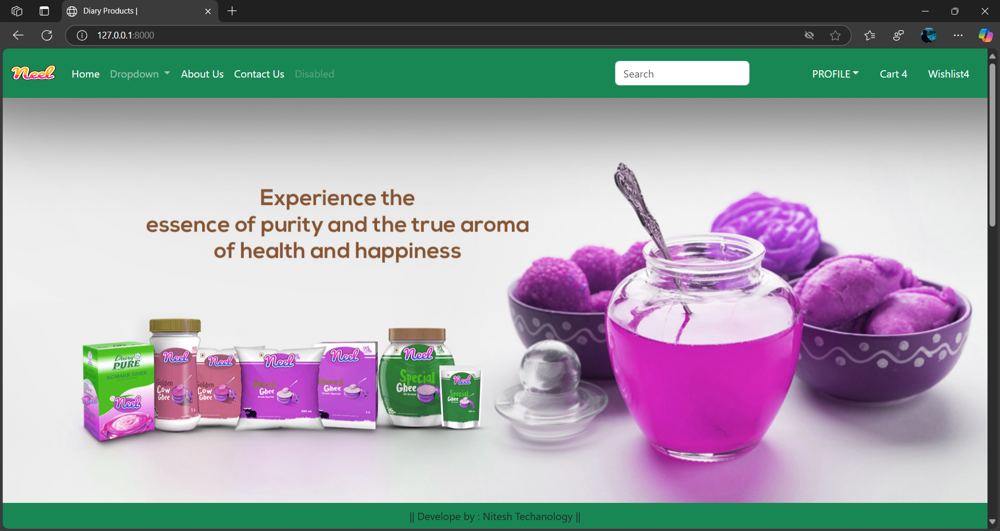

# Glocery-Store-Appllication
# 🛒 Grocery Store Application (Django)

A full-featured Django-based web application designed for managing an online grocery store. This project demonstrates real-time eCommerce functionality including user authentication, product management, shopping cart, and order checkout.

---

## 🚀 Key Features

- ✅ User Registration & Login (with authentication)
- 🛍️ Add to Cart, View Cart, and Checkout system
- 🧺 Product listing and detail view
- 📦 Admin panel for product management
- 📧 Order confirmation via email (optional)
- 📱 Responsive design using HTML, CSS, and Bootstrap

---

## 📂 Technologies Used

- **Backend:** Python, Django
- **Frontend:** HTML5, CSS3, Bootstrap, JavaScript
- **Database:** SQLite (can be switched to MySQL or PostgreSQL)
- **Version Control:** Git & GitHub

---

## 📸 Screenshots

*(Add screenshots of key pages: Home, Product Page, Cart, Checkout, Admin Panel)*  
*You can upload images in the repo and link like this:*  
```markdown

